# AnyCap Access

Choose one access path before touching credentials or client configuration.
CLI and MCP share AnyCap intent but have different transport, authentication,
schema, and completion evidence.

## Route one path

| Need | Read |
| --- | --- |
| install, login, config, update | [setup-auth-config.md](references/setup-auth-config.md) |
| MCP client config, auth, availability, or publication gate | [mcp.md](references/mcp.md) |
| Feishu local-agent daemon | [agent-daemon.md](references/agent-daemon.md) |
| search / crawl | [search.md](references/search.md) / [crawl.md](references/crawl.md) |
| image / video / music / audio commands | [generation.md](references/generation.md), [video-generation.md](references/video-generation.md), [music-generation.md](references/music-generation.md), or [audio-generation.md](references/audio-generation.md) |
| media understanding/actions | [actions.md](references/actions.md) |
| annotation / Draw | [annotation.md](references/annotation.md) / [draw.md](references/draw.md) |
| Drive / Page / Snapshot | [drive.md](references/drive.md), [page.md](references/page.md), or [snapshot.md](references/snapshot.md) |
| exact CLI fallback | [cli-reference.md](references/cli-reference.md) |

Read only the selected route. Use `anycap status` when authentication or endpoint
state is unknown or a command reports an auth error, not before every operation.

## Shared workflow

1. Freeze `path | client | command/endpoint/profile | environment | availability claim | allowed side effects`.
2. Discover the live command, model/mode schema, or MCP tool schema required for
   that path. Do not load a historical catalog or guess a response shape.
3. Use the smallest operation that proves the requested outcome. Give local
   outputs explicit paths and parse only fields needed by the next step.
4. Validate the actual file, structured response, MCP handshake, or delivery
   read-back. Preserve safe request/session identifiers when present.

For MCP, separate `implemented`, `installed/published`, `reachable`,
`authenticated`, and `business-call verified`. Completion requires
`initialize`, live `tools/list`, and one route-appropriate read-back.
Configuration text, DNS, health, source code, or a package name proves only its
own layer.

## Ownership boundary

- Multi-source investigation routes to `anycap-research`; SEO and drafting route
  to `anycap-content`; explicit media routes to `anycap-media`; spatial or
  narrated human feedback routes to `anycap-human-interaction`.
- Generic image semantics begin at `image-gen`; system diagrams at
  `image-gen-system`; exact charts at `chart-gen`; software technical videos at
  `video-gen`.
- Server code, deployment, DNS/TLS, OAuth tenant rollout, npm publication, and
  mutable product facts remain in the AnyCap owning repository.

## Remote write and credential gate

Local output and read-only discovery are the default. Credential changes, MCP
host configuration, daemon setup, Drive upload/share, Page deploy, Snapshot
create, annotation/Draw update, or any tool with external side effects runs only
when the current user authorizes the exact operation, target, environment, and
audience. One generation approval does not authorize delivery.

Use interactive/device flow, environment variables, OS credential storage, or
the CLI store. Never request, echo, persist, or move a secret across CLI and Hosted
HTTP boundaries. A failed hosted route does not authorize bypassing it for a
direct product API, provider API, database, or internal network.

For login, use the device flow: start `anycap login --headless --no-wait --json`,
give the human the verification URL and one-time code, poll, and verify
`anycap status`. The human completes account selection, password, OTP, CAPTCHA,
passkey, and consent steps. Authentication does not authorize Drive/Page
delivery, publication, or account/security changes.

## Output contract

Report the chosen path and availability layer, redacted command/endpoint/profile,
auth mechanism and result, live schema source, operation result, validation
evidence, remaining gap, and the smallest safe next action. Do not print full
JSON when it may contain private inputs, signed URLs, or unrelated metadata.
