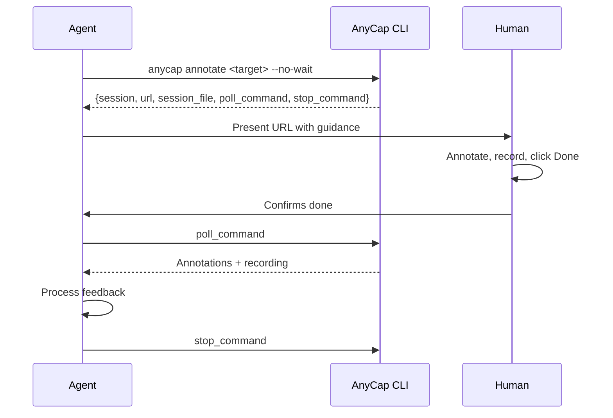

# URL and web-page review

## When to Use Annotation

Use annotation when:

- You generated an image/video and need the human to point at what to change
- You built or modified a web page and need the human to review it visually
- You need spatially-grounded feedback ("move this here", "this area is wrong")
- Text-only feedback would be ambiguous about location or visual details
- You want the human to record a narrated walkthrough of their feedback

Do NOT use annotation when:

- You only need a yes/no approval (just ask in chat)
- The feedback is purely textual (e.g., "change the title text to X")

## Interaction Pattern

All annotation workflows follow this pattern:



### The "Done" Button

The human clicks **Done** in the annotation toolbar to save their feedback. The behavior differs by mode:

- **Blocking mode** (no `--no-wait`): Clicking Done ends the session. The CLI command returns immediately with the result. In collaborative modes (image, video, audio), other connected users see a "Feedback Submitted" overlay.
- **Non-blocking mode** (`--no-wait`): Clicking Done **saves** the feedback without ending the session. In collaborative modes, other users see a toast notification and can keep annotating. Each subsequent Done click overwrites the saved result. The agent polls to retrieve the latest saved state.

**For agents:** Always tell the human to click **Done** when they are finished. In non-blocking mode with multiple reviewers (image/video/audio only), each reviewer can save independently -- the poll result reflects the most recent save.

### Session Recovery

Session state is persisted at `.anycap/annotate/<session_id>.json` in the working directory (returned as `session_file` in the start response). If you lose the session ID or commands after a context reset:

```bash
# List all sessions with their status and recovery commands
anycap annotate list
```

The `list` output includes `poll_command` and `stop_command` for each session, so you can resume without manually reading session files.

---

## Scenario 1: URL / Web Page Review

Use when you built or modified a web page, UI, or any browser-accessible content and need the human to review it visually.

> **URL mode is single-user.** Recording is the primary feedback artifact (cross-origin iframe prevents annotated screenshot export). Multiple users' cursors and annotations would make the recording confusing. The client name tag and peers indicator are hidden. Only one person should review a URL session at a time.

**Why recording matters:** Unlike image mode, URL mode cannot export an annotated screenshot (cross-origin iframe restriction). The **screen recording with narration** is the primary feedback artifact. The human browses your page inside the annotation frame, draws annotations on top, and records a narrated walkthrough -- you get both the visual markups and a video of exactly what they saw and said.

### Start the Session

```bash
# Local dev server
anycap annotate http://localhost:3000 --no-wait

# Live URL
anycap annotate https://staging.example.com --no-wait
```

### Collect and Analyze Feedback

```bash
# Poll for result
anycap annotate poll --session <session_id>

# Check if recording exists
RECORDING=$(anycap annotate poll --session <session_id> | jq -r '.recording // empty')

# Analyze the recording with AI video understanding
if [ -n "$RECORDING" ]; then
  anycap actions video-read --file "$RECORDING" \
    --instruction "List all issues the user pointed out. For each issue, describe what they are looking at, what is wrong, and what they want changed. Include timestamps."
fi

# Also read text annotations
anycap annotate poll --session <session_id> \
  | jq -r '.annotations[] | "#\(.id) [\(.type)]: \(.label)"'

# Clean up
anycap annotate stop --session <session_id>
```

> **Recording may be empty.** The Rec button uses the browser's `getDisplayMedia` API, which requires the user to grant screen-sharing permission. If the user declines the permission prompt or never clicks Rec, the `recording` field will be absent from the poll result. Always check for its existence before attempting video-read. Text annotations are still available regardless.

### Applying URL Feedback -- Iterative Review

URL review feedback typically maps to code changes, not image generation. After analyzing the recording and annotations:

1. Identify which files need changes based on the visual feedback
2. Make the code changes
3. Stop the previous session
4. Start a **new** annotation session for the human to verify

Each round of changes requires a fresh session because the URL content has changed:

```bash
# Round 1: Initial review
anycap annotate http://localhost:3000 --no-wait
# ... human reviews, you poll and analyze ...
anycap annotate stop --session <session_1>

# Apply code changes based on feedback
# ... edit files ...

# Round 2: Verification review
anycap annotate http://localhost:3000 --no-wait
# ... human confirms or gives more feedback ...
anycap annotate stop --session <session_2>
```

Version your rounds in your messages so the human can track progress ("Round 2: I addressed issues #1 and #3 from your first review").

### Recording Analysis Patterns

The recording is a `.webm` video captured from the browser tab, including annotations being drawn and voice narration. Use `anycap actions video-read` to analyze it:

```bash
# General feedback extraction
anycap actions video-read --file <recording_path> \
  --instruction "List all issues and desired changes the user described"

# UI-specific review
anycap actions video-read --file <recording_path> \
  --instruction "For each UI element the user points at, describe the current state and the desired change"

# Prioritized feedback
anycap actions video-read --file <recording_path> \
  --instruction "Categorize the user's feedback by priority (critical, important, nice-to-have)"
```

---
