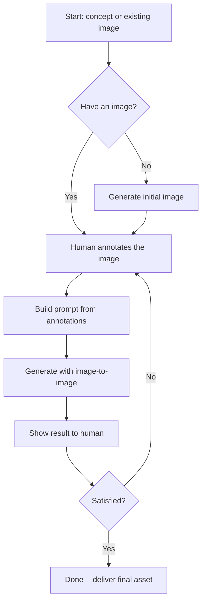

# Image production

## Image Production

### Text-to-Image

Generate an image from a text prompt:

```bash
anycap image generate \
  --prompt "a cozy home office with a wooden desk, laptop, coffee cup, and plants by the window" \
  --model <model-id> \
  -o workspace-v1.png
```

### Image-to-Image (Edit / Transform)

Use `--mode image-to-image` with a reference image to edit or transform an existing image:

```bash
anycap image generate \
  --prompt "make it a watercolor painting" \
  --model <model-id> \
  --mode image-to-image \
  --param images=./photo.png \
  -o photo-watercolor.png
```

Reference images can be local paths or URLs. The CLI handles upload automatically.

### Multiple Reference Images

Some models accept multiple reference images for style transfer, composition blending, or subject-driven generation. Use JSON array syntax to pass multiple files:

```bash
# Combine style from one image with composition from another
anycap image generate \
  --prompt "merge the architectural style of the first image with the color palette of the second" \
  --model <model-id> \
  --mode image-to-image \
  --param images='["./style-ref.png","./color-ref.png"]' \
  -o blended.png

# Mix local files and URLs
anycap image generate \
  --prompt "a portrait in the style of the reference images" \
  --model <model-id> \
  --mode image-to-image \
  --param images='["./local-ref.png","https://example.com/style-ref.jpg"]' \
  -o portrait-styled.png
```

Tips:
- Use JSON array syntax `'["path1","path2"]'` -- repeating `--param images=` overwrites rather than appends.
- Local file paths inside the array are auto-uploaded, same as single-file mode.
- Not all models support multiple references. Check the model schema first. When unsupported, the model typically uses only the first image.

### Iterative Refinement with Annotation

When text prompts alone cannot describe the desired edit precisely ("move this", "remove that specific thing", "change the color of this area"), use the annotation workflow. For the full annotation guide -- including URL/video review, headless access, recording analysis, and multi-user collaboration -- read the `anycap-human-interaction` skill.



#### Step 1: Generate or Use an Existing Image

```bash
anycap image generate \
  --prompt "a landing page hero banner with mountains and sunrise" \
  --model <model-id> \
  -o banner-v1.png
```

#### Step 2: Annotate

Open the annotation tool so the human can visually mark regions, describe desired changes, and optionally record a narrated walkthrough. Multiple users can collaborate on the same session in real-time.

**For agent workflows** (non-blocking, recommended):

```bash
anycap annotate banner-v1.png --no-wait -o banner-v1-annotated.png
# Returns: {session, url, poll_command, stop_command}
```

Show the URL to the human and ask them to annotate. Multiple people can open the same URL to collaborate. Wait for the human to confirm they are done, then:

```bash
# Fetch the result (single call, no loop)
anycap annotate poll --session <session_id>

# If recording exists, analyze it for visual understanding
anycap actions video-read --file .anycap/annotate/<session_id>/recording.webm \
  --instruction "Describe what changes the user wants"

# Clean up
anycap annotate stop --session <session_id>
```

**For interactive sessions** (human is at the terminal):

```bash
anycap annotate banner-v1.png -o banner-v1-annotated.png
# Blocks until Done click, outputs annotation JSON
```

The annotation tool supports four tools: Rectangle (`R`), Arrow (`A`), Point (`P`), Freehand (`F`). Each annotation gets a numbered marker and a text label.

#### Step 3: Build a Prompt from Annotations

The annotation output contains structured data. Translate each label into a coherent prompt:

```json
{
  "annotations": [
    {"id": 1, "type": "rect", "label": "Replace with a standing desk"},
    {"id": 2, "type": "point", "label": "Add a cat sitting here"},
    {"id": 3, "type": "freehand", "label": "This area should be a bookshelf"}
  ]
}
```

Prompt: "#1: Replace the desk with a standing desk. #2: Add a cat sitting at the marked position. #3: Transform the outlined area into a bookshelf. Keep all other elements unchanged."

Rules:
- Reference each annotation by its number (#1, #2, etc.)
- Include the human's exact label text
- Add "Keep all other elements unchanged" to preserve unmodified areas

#### Step 4: Apply the Edit

Use the **annotated image** (with visual markers) as the reference:

```bash
anycap image generate \
  --prompt "#1: Replace the desk with a standing desk. #2: Add a cat. Keep all other elements unchanged." \
  --model <model-id> \
  --mode image-to-image \
  --param images=./banner-v1-annotated.png \
  -o banner-v2.png
```

#### Step 5: Iterate

If the human wants more changes, use the latest version as input and repeat from Step 2. Version filenames (`v1`, `v2`, `v3`) so the human can compare and revert.

### Image Tips

- **Start broad, refine narrow.** First generation nails the composition. Annotation iterations handle targeted adjustments.
- **One thing at a time.** If multi-region edits produce poor results, try one annotation per pass.
- **Annotated image only.** Pass only the annotated image as the reference. Most models understand numbered markers and remove them from the output.

### Image Completion Gate

File creation is not completion. Before returning, uploading, or sharing an
image:

- verify the actual file type, dimensions, aspect ratio, and nonblank output;
- inspect it at original resolution and at the intended crop/thumbnail size;
- check subject identity, requested composition, reserved text zones,
  pseudo-text, duplicate objects, logos/watermarks, and unintended sensitive
  data;
- run `anycap actions image-read` before accepting any requested no-text asset,
  using a strict scan for words, letters, numbers, logos, copyright marks,
  watermarks, pseudo-text, and UI traces; any hit is a failure, including for an
  intentionally atmospheric hero;
- when the image contains requested visible text or information geometry, pass
  `required_text`, `allowed_display_text`, required nodes/edges, independent
  sets, and forbidden semantics to image-read; fail on extra/duplicate/malformed
  text, missing or wrong connectors, or a false sequence;
- after an edit, re-audit protected regions and the complete fact graph rather
  than inheriting the previous candidate's pass.
- create `<asset-basename>.prompt.md` with the brief/fact graph, live
  model/schema, command, references, output path, checks, rejected candidates,
  and limitations;
- return the local asset package to the diagram/report/deck/page owner for
  consumer-surface QA when this skill is only the delegated raster producer.
