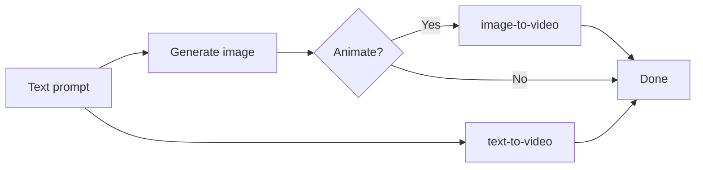

# Video production

## Video Production

### Text-to-Video

```bash
anycap video generate \
  --prompt "a cat walking on the beach at sunset, cinematic, slow motion" \
  --model <model-id> \
  -o cat-beach.mp4
```

### Image-to-Video

Animate a still image:

```bash
anycap video generate \
  --prompt "gentle camera pan across the landscape, wind blowing through trees" \
  --model <model-id> \
  --mode image-to-video \
  --param images=./landscape.png \
  -o landscape-animated.mp4
```

This is powerful for combining with image generation: generate a still image first, then animate it.

### Video Production Workflow



For best results with image-to-video:
1. Generate a high-quality still image first (iterate with annotation if needed)
2. Use the final image as the reference for video generation
3. Keep the video prompt focused on motion and camera movement, not scene description

### Video Tips

- Video generation takes 30-120s. Use async execution when your runtime supports it.
- Check model schema for supported parameters (`aspect_ratio`, `duration`, etc.).
- Different models excel at different styles. Check available models with `anycap video models`.
